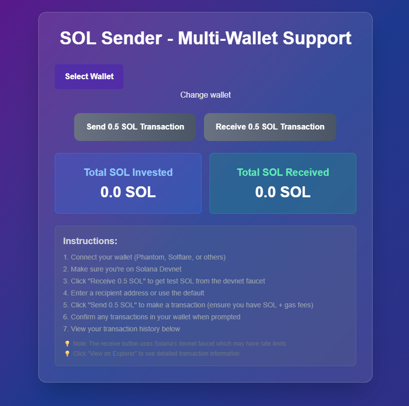

# SOL Sender - Solana Transaction Application

A Next.js application that enables secure SOL token transfers on Solana devnet with Phantom wallet integration, transaction tracking, and a modern UI.


*SOL Sender UI with wallet connection and transaction features*

## 🎯 **Project Overview**

- **Frontend**: Next.js 15 with TypeScript and App Router
- **Styling**: Tailwind CSS with gradient theme
- **Blockchain**: Solana Web3.js (devnet)
- **Wallets**: Phantom and Solflare integration

## ✨ **Key Features**

- **Wallet Connection**: Seamless integration with Phantom and Solflare
- **SOL Transfers**: Send 0.5 SOL transactions on devnet
- **Transaction Tracking**: Counter for total SOL invested
- **Responsive UI**: Modern design with loading states
- **Error Handling**: Comprehensive validation and user feedback

## �️ **Setup & Installation**

### **Prerequisites**
- **Node.js 18+** and **npm**
- **Phantom** or **Solflare** wallet browser extension
- **Devnet SOL** from [faucet.solana.com](https://faucet.solana.com/)

### **Quick Start**
```bash
# Clone and install
git clone <repo-url>
cd solsender
npm install

# Start development server
npm run dev

# Access at http://localhost:3000
```

## 📖 **Usage Guide**

1. **Connect Wallet**:
   - Click "Select Wallet" 
   - Choose Phantom or Solflare
   - Ensure wallet is set to Solana devnet

2. **Send Transaction**:
   - Click "Send 0.5 SOL" button
   - Approve in wallet popup
   - View confirmation and transaction signature

## 🏗️ **Project Structure**
```
solsender/
├── src/
│   ├── app/                     # Next.js App Router
│   │   ├── layout.tsx          # Root layout with wallet provider
│   │   ├── page.tsx            # Main application page
│   │   ├── globals.css         # Global styles and Tailwind
│   │   └── wallet-adapter.css  # Custom wallet styling
│   ├── components/
│   │   └── SolanaTransaction.tsx # Main transaction interface
│   └── contexts/
│       ├── WalletContextProvider.tsx # Wallet adapter configuration
│       └── ClientWalletProvider.tsx  # Client-side wrapper
├── public/                      # Static assets
├── .github/
│   └── copilot-instructions.md # Development guidelines
├── next.config.ts              # Next.js configuration
├── tailwind.config.ts          # Tailwind CSS configuration
├── tsconfig.json              # TypeScript configuration
└── package.json               # Dependencies and scripts
```
## ⚙️ **Customization**

### **Transaction Settings**
```typescript
// In src/components/SolanaTransaction.tsx
// Change amount or destination address
lamports: 0.5 * LAMPORTS_PER_SOL
const DESTINATION_ADDRESS = 'YOUR_ADDRESS';
```

### **Network Configuration**
```typescript
// In src/contexts/WalletContextProvider.tsx
const network = WalletAdapterNetwork.Devnet;
```

## 🐛 **Troubleshooting**

| Issue | Solution |
|-------|----------|
| Wallet not connecting | Ensure extension is installed and unlocked |
| Insufficient balance | Get more SOL from [faucet.solana.com](https://faucet.solana.com/) |
| Transaction failing | Verify wallet is on Solana devnet |

## 🚀 **Deployment**

```bash
# Deploy to Vercel (recommended)
npm i -g vercel
vercel --prod

# Or build locally
npm run build
npm start
```

## 🔒 **Security Notes**

- Always use devnet for testing
- Never expose private keys
- Verify transaction details before confirming

## 🤝 **Contributing**

1. Fork the repository
2. Create a feature branch
3. Make changes and test on devnet
4. Submit a pull request with clear description
